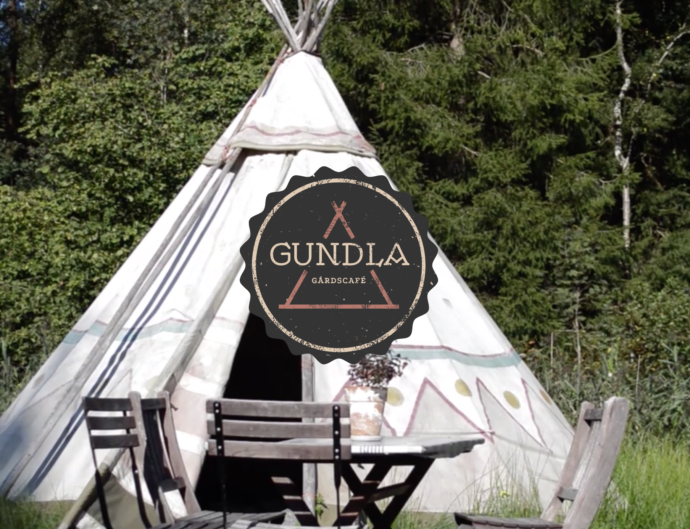

# Picture This


### About

In this assignment we are going to build an landingpage for Gundla Gårdscafé. A café located in the beautiful Delsjön area of Gothenburg. We decided to work with ``Next.js``, ``Sanity Studio`` & ``Styled Components``.

### Open Sanity Studio Headless CMS

* First you have to clone the repository gundla-gardscafe, either via [this link](https://github.com/vpuke/gundla-gardscafe) in Github desktop or `git clone https://github.com/vpuke/gundla-gardscafe.git` in the terminal of your choice.
* Run commad ``npm install``
* Navigate to ``studio`` folder via the terminal & write ``sanity start``.
* Open Browser and write ```http://localhost:3333``` in address field.


### Open Homepage in browser on localhost
* First you have to clone the repository gundla-gardscafe, either via [this link](https://github.com/vpuke/gundla-gardscafe) in Github desktop or `git clone https://github.com/vpuke/gundla-gardscafe.git` in the terminal of your choice.
* Run command ``npm install``.
* Navigate to ``web`` folder via the terminal & write ``npm run dev``.
* Open Browser and write ```http://localhost:3000``` in the address field.

### Coded by

* [Michaela Lundborg](https://github.com/lundborgm)
* [Viktor Puke](https://github.com/vpuke) 

### Designers

* Hampus Jerkfelt
* Rasmus Hermansson

### License

This project is licensed under MIT license, please see further details [here](https://github.com/Vpuke/gundla-gardscafe/blob/master/LICENSE)